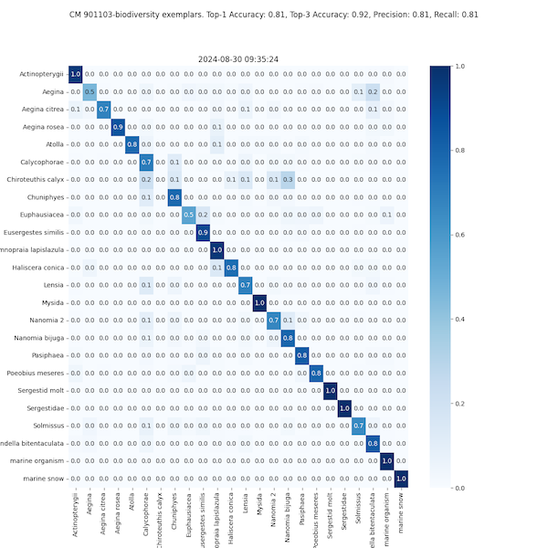

[](http://www.mbari.org)
[](https://www.python.org/downloads/)

*aipipeline* is a library for running ai pipelines and monitoring the performance of the pipelines,
e.g. accuracy, precision, recall, F1 score. This may include object detection, 
clustering, classification, and vector search algorithms. It is designed to be used for a number of projects at MBARI 
that require advanced workflows to process large amounts of images or video.

### See the [MBARI AI documentation](https://docs.mbari.org/internal/ai) for more information on the tools and services used in the pipelines.

---
Example plots from the t-SNE, confusion matrix and accuracy analysis of examplar data.




--- 
## Requirements

Three tools are required to run the code in this repository:

### [Anaconda](https://www.anaconda.com/products/distribution) environment
This is a package manager for python.  We recommend using the [Miniconda](https://docs.conda.io/en/latest/miniconda.html) version of Anaconda.
Install on **Mac OS X** with the following command:
```shell
brew install miniconda
```
or on **Ubuntu** with the following command:
```shell
sudo apt install miniconda
```
### [Docker](https://www.docker.com)
This is a containerization tool that allows you to run code in a container.

### [just](https://github.com/casey/just) tool. 
This is a handy tool for running scripts in the project. This is easier to use than `make` 
and more clean than bash scripts. Try it out!

Install on **Mac OS X** with the following command:
```shell
port install just
```
or on **Ubuntu** with the following command:
```shell
sudo apt install just
```

## Installation 

Clone the repository and run the setup command.
```shell
git clone http://github.com/mbari-org/aipipeline.git
cd aipipeline
just setup
``` 
Sensitive information is stored in a .env file in the root directory of the project,
so you need to create a .env file with the following contents in the root directory of the project:

```shell
TATOR_TOKEN=your_api_token
REDIS_PASSWORD=your_redis_password
ENVIRONMENT=testing or production
```


## Usage

Recipes are available to run the pipelines.  To see the available recipes, run the following command:
```shell
just list
```

| Recipe                  | Description                                                                                                                        |
|-------------------------|------------------------------------------------------------------------------------------------------------------------------------|
| `list`                                           | List recipes                                                                                                 |
| `install`                                        | Setup the environment                                                                                        |
| `update`                                         | Update the environment. Run this command after checking out any code changes                                  |
| `plot-tsne-vss project='uav'`                    | Generate a t-SNE plot of the VSS database                                                                    |
| `calc-acc-vss project='uav'`                     | Calculate the accuracy of the VSS database                                                                   |
| `reset-vss-all`                                  | Reset the VSS database, removing all data. Proceed with caution!!                                             |
| `reset-vss project='uav'`                        | Reset the VSS database, removing all data. Run before `init-vss` or when creating the database.               |
| `init-vss project='uav' *more_args=""`           | Initialize the VSS database for the UAV project                                                              |
| `cluster-uav`                                    | Cluster mission in `aipipeline/projects/uav/data/missions2process.txt`                                        |
| `detect-uav *more_args=""`                       | Detect mission in `aipipeline/projects/uav/data/missions2process.txt`, add `--vss` to classify with VSS       |
| `detect-uav-test`                                | Detect mission data in `aipipeline/projects/uav/data/missions2process.txt`                                    |
| `load-uav-images`                                | Load UAV mission images in `aipipeline/projects/uav/data/missions2process.txt`                                |
| `load-uav type="cluster"`                        | Load UAV detections/clusters in `aipipeline/projects/uav/data/missions2process.txt`                           |
| `fix-uav-metadata`                               | Fix UAV metadata lat/lon/alt                                                                                 |
| `compute-saliency project='uav' *more_args=""`   | Compute saliency for downloaded VOC data and update the Tator database                                        |
| `download-crop-unknowns project='uav' label='Unknown' download_dir='/tmp/download'` | Download and crop Unknown detections                                                                         |
| `download project='uav'`                         | Download only                                                                                                |
| `predict-vss project='uav' image_dir='/tmp/download' *more_args=""` | Predict images using the VSS database                                                                         |
| `run-ctenoA-test`                                | Run the strided inference on a single video                                                                  |
| `run-ctenoA-prod`                                | Run the strided inference on a collection of videos in a TSV file                                             |

--

### Related projects

- [aidata](https://github.com/mbari-org/aidata) -A tool to extract, transform, load and download operations on AI data.
- [sdcat](https://github.com/mbari-org/sdcat) - Sliced Detection and Clustering Analysis Toolkit; a tool to detect and cluster objects in images.
- [deepsea-ai](https://github.com/mbari-org/deepsea-ai) - A tool to train and run object detection and tracking on video at scale in the cloud (AWS).
- [fastapi-yolov5](https://github.com/mbari-org/fastapi-yolov5) - A RESTful API for running YOLOv5 object detection models on images either locally or in the cloud (AWS).
- [fastapi-vss](https://github.com/mbari-org/fastapi-vss) - A RESTful API for vector similarity search using foundational models.
- [fastapi-tator](https://github.com/mbari-org/fastapi-tator) - A RESTful API server for bulk operations on a Tator annotation database.

**updated: 2024-10-07**