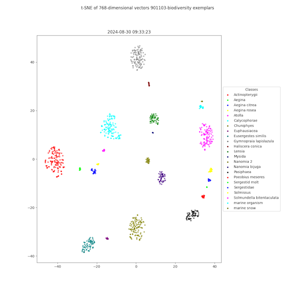

[](http://www.mbari.org)
[](https://www.python.org/downloads/)

*aipipeline* is a library for running AI pipelines and monitoring the performance of the pipelines,
e.g. balanced accuracy. This may include object detection, clustering, classification, and vector search algorithms. 
It is designed to be used for a number of projects at MBARI that require advanced workflows to process large amounts
of images or video.  After workflows are developed, they may be moved to the project repositories for production use.  

### See the [MBARI Internal AI documentation](https://docs.mbari.org/internal/ai) for more information on the tools and services used in the pipelines and what is coming in the core roadmap.

---
Example plots from the t-SNE, confusion matrix and accuracy analysis of exemplar data.




--- 
## Requirements

Three tools are required to run the code in this repository:

### Python and a virtual environment 
Recommend using the [Miniconda](https://docs.conda.io/en/latest/miniconda.html) version of Anaconda to manage python versions and virtual environments.
This works well across all platforms.

Install on **Mac OS X** with the following command:
```shell
brew install miniconda
```
or on **Ubuntu** with the following command:
```shell
sudo apt install miniconda
```
### [Docker](https://www.docker.com)
This is a containerization tool that allows you to run code in a container.

### [just](https://github.com/casey/just) tool. 
This is a handy tool for running scripts in the project. This is easier to use than `make` 
and more clean than bash scripts. Try it out!

Install on **Mac OS X** with the following command:
```shell
port install just
```
or on **Ubuntu** with the following command:
```shell
sudo apt install just
```

## Installation 

Clone the repository and run the setup command.
```shell
git clone http://github.com/mbari-org/aipipeline.git
cd aipipeline
just setup
``` 
Sensitive information is stored in a .env file in the root directory of the project,
so you need to create a .env file with the following contents in the root directory of the project:

```shell
TATOR_TOKEN=your_api_token
REDIS_PASSWORD=your_redis_password
```


## Usage

Recipes are available to run common operations and processing pipelines.  To see the available recipes, run the following command:
```shell
just list
```
 
# Justfile Recipes

## Setup & Utilities

- `list` — List recipes  
- `install` — Setup the environment  
- `cp-env` — Copy the default `.env` file to the project  
- `update_trackers` — Update the environment (run after checking out code changes)  
- `update-env` — Update environment  
- `cp-core` — Copy core dev code to the project on Doris  
- `cp-dev-cfe` — Copy CFE dev code to the project on Doris  
- `cp-dev-ptvr` — Copy Planktivore dev code to the project on Doris  
- `cp-dev-uav` — Copy UAV dev code to the project on Doris  
- `cp-dev-bio` — Copy Bio dev code to the project on Doris  
- `cp-dev-i2map` — Copy i2MAP dev code to the project on Doris 
- `cp-dev-vss` — Copy Vector Search System (VSS) dev code to the project on Doris   

## Labeling & Initialization

- `init-labels project='uav' leaf_type_id='19'` — Initialize labels for quick lookup  
- `plot-tsne-vss project='uav'` — Generate a t-SNE plot of the VSS database  
- `optimize-vss project='uav' *more_args=""`  
- `calc-acc-vss project='uav'` — Calculate VSS accuracy after download and optimization  
- `reset-vss-all` — Reset **all** VSS data (dangerous)  
- `reset-vss project='uav'` — Reset VSS database for a project  
- `remove-vss project='uav' *more_args=""` — Remove VSS entry (e.g., `--doc 'doc:marine organism:*'`)  
- `init-vss project='uav'` — Initialize VSS for a project using all verified labels  
- `load-vss project='uav'` — Load precomputed exemplars into VSS  
- `gen-stats-csv project='UAV' data='...'`  - Generate training data stats from downloaded data. Aggregate stats for nested directories

## CFE ISIIS

- `load-cfe-isiis-videos missions=""` — Load CFE ISIIS mission videos  
- `load-cfe-isiis-sdcat data_dir="" stride="14"` — Load CFE ISIIS detections/clusters  
- `cluster-cfe-isiis roi_dir="..." save_dir="..."` — Cluster CFE ISIIS Hawaii frames  
- `cluster-cfe-isiis-hawaii-p1` — First pass clustering for CFE Hawaii  
- `cluster-cfe-isiis-hawaii-p2 p1_dir=""` — Second pass clustering
- `gen-cfe-data` — Generate training data for CFE
- `transcode-cfe-isiis-rc` — Transcode Rachel Carson videos  
- `transcode-cfe-isiis-hawaii` — Transcode Hawaii videos
- `gen-cfe-dino_v7` - Generate data for the CFE project from the deployment version cfe_isiis_dino_v7-20250916
- `merge-media-cfe-isiis-rc` - Merge absolute media paths for CFE ISII RC mission with downloaded localizations.csv
- `fast-crop-cfe-isiis-rc` - Fast ROI crop for CFE ISIIS mission videos


## Biodiversity

- `predict-vss-velella` — Predict Velella images using VSS
- `run-mega-stride-bio video='...'` — Mega stride on bio video  
- `run-mega-track-bio video='...'` — Mega tracking on dive  
- `run-mega-track-test-1min` — 1-minute test video  
- `run-mega-track-test-fastapiyv5` — With FastAPI  
- `gen-bio-data image_dir=""` — Generate training data for either classification or detection models
- `run-ctenoA-prod` — Inference on videos in TSV  
- `run-mega-inference` — Mega inference on one video  
  
 
## Planktivore

- `load-ptvr-images images='tmp/roi' *more_args=""` — Load Planktivore ROI images  
- `cluster-ptvr-images *more_args=""` — Cluster Planktivore ROI images  
- `load-ptvr-clusters clusters='tmp/roi/cluster.csv' *more_args=""` — Load Planktivore ROI clusters  
- `rescale-ifcb-images collection="2014"` — Rescale IFCB images  
- `rescale-ptvr-images collection="..."`  
- `download-rescale-ptvr-images collection="..."` — Download and rescale Planktivore images  
- `cluster-ptvr-sweep roi_dir='...' save_dir='...' device='cuda'` — Run cluster sweep on Planktivore data  
- `gen-ptvr-lowmag-data` — Generate low-mag training data  
- `init-ptvr-lowmag-vss` — Init VSS DB for low-mag Planktivore data  
- `add-depth-time-ptvr year="2025" *more_args=""` — Add depth and time to Planktivore parquet files (needed for downstream processing). Skips already processed files by default; use `--no-skip` to disable.

**Environment for `add-depth-time-ptvr`:**
```shell
conda create -n pandas-parquet \
  -c conda-forge \
  python=3.12 \
  pandas==3.0.0 \
  xarray \
  netcdf4 -y
```

## UAV (Unmanned Aerial Vehicle)
IMPORTANT: Many of these command are now run on the production server, *uav.shore.mbari.org*
See the [bitbucket uavprocessing repo](bitbucket.org/mbari/uavprocessing.git) for more details.

- `cluster-uav *more_args=""` — Cluster UAV missions - only run on the production server
- `detect-uav *more_args=""` — Detect UAV missions - only run on the production server
- `load-uav-images` — Load UAV mission images - only run on the production server
- `load-uav type="cluster"` — Load UAV detections/clusters - only run on the production server
- `fix-uav-metadata` — Fix UAV metadata (lat/lon/alt)
- `detect-uav-test` — Test detect UAV missions  
- `gen-uav-data` — Generate training data  

## i2MAP

- `run-mega-stride-i2map video='...' vit_model='...' version='...'`  
- `run-mega-track-i2map video='...' vit_model='...' version='...'`  
- `cluster-i2mapbulk` — Run inference & clustering on i2MAP bulk  
- `transcode-i2map input_dir='...' output_dir='' ` — Transcode i2MAP `.mov` to `.mp4` for use with Tator
- `load-i2mapbulk data='data'`  
- `download-i2mapbulk-unlabeled` — Get unlabeled data   
- `gen-i2map-data` — Generate training data from *mantis.shore.mbari.org* server for either classification or detection models
- `gen-i2mapbulk-data` — Generate training from *i2map.shore.mbari.org* server for either classification or detection models


## Miscellaneous

- `replace-m3-urls` — Replace `m3` URLs with Mantis URLs in the database
 
--

### Related projects

- [aidata](https://github.com/mbari-org/aidata) -A tool to extract, transform, load and download operations on AI data.
- [sdcat](https://github.com/mbari-org/sdcat) - Sliced Detection and Clustering Analysis Toolkit; a tool to detect and cluster objects in images.
- [deepsea-ai](https://github.com/mbari-org/deepsea-ai) - A tool to train and run object detection and tracking on video at scale in the cloud (AWS).
- [fastapi-yolov5](https://github.com/mbari-org/fastapi-yolov5) - A RESTful API for running YOLOv5 object detection models on images either locally or in the cloud (AWS).
- [fastapi-vss](https://github.com/mbari-org/fastapi-vss) - A RESTful API for vector similarity search using foundational models.
- [fastapi-tator](https://github.com/mbari-org/fastapi-tator) - A RESTful API server for bulk operations on a Tator annotation database.


🗓️ Last updated: 2025-08-13